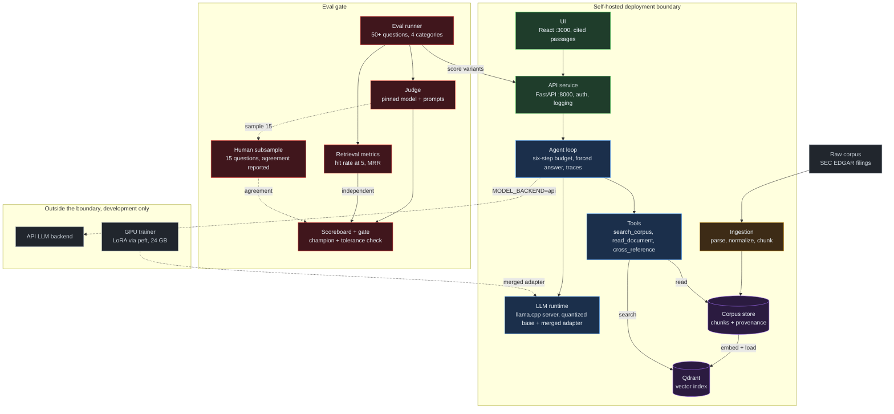
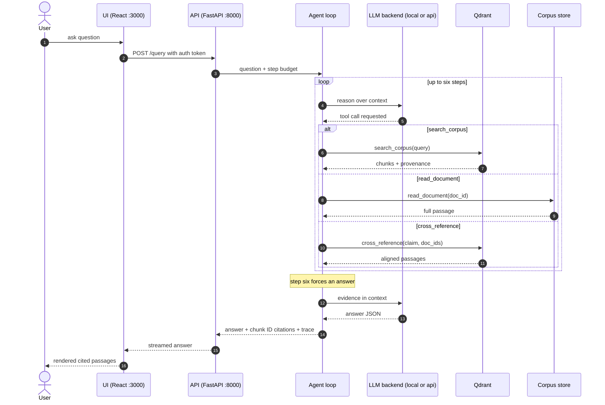

# CorpusGate

A private corpus agent with an eval gate. CorpusGate ingests a messy real-world document corpus, stands up a fine-tuned plus RAG agent over it that runs entirely on infrastructure the operator controls, and proves with a scored eval harness that each added layer earned its place. Retrieval, agentic tool use, and LoRA fine-tuning are hypotheses, not assumptions. No variant is promoted unless the gate says it beat the champion.

This document is the specification the code is held to; where the two disagree, one of them has a bug.

## 1. Principles

1. **The eval set is version zero.** The graded question set comes before the product: `evalset/questions.jsonl` holds 50 or more graded questions with rubrics across four categories, and `make eval` scores an arbitrary variant against it, before any ingestion, chunking, or retrieval code exists.
2. **Every layer pays rent.** Each variant (RAG, RAG plus agent, RAG plus agent plus fine-tune) is promoted only through the gate: overall score up versus the current champion, no category regressing beyond the tolerance in `configs/eval.yaml`. A rejected variant is documented in `docs/findings/`, never deleted.
3. **Citations are structural.** The answer schema requires chunk IDs, the UI renders the actual cited passages, and the eval scores citation correctness. An uncited claim is a scored failure.
4. **The judge is audited.** The judge model and prompts are pinned and versioned in `configs/judge.yaml`. Every full eval run includes a 15-question human-scored subsample with judge-human agreement reported in the milestone finding.
5. **Decontamination.** Fine-tuning data is deduplicated against the eval set by embedding similarity before training. The dedup report is committed with each adapter version.
6. **Self-hosting boundary.** With `MODEL_BACKEND=local`, no corpus content leaves the deployment boundary. The API backend exists as a development convenience only and must never be the default in a deployed configuration.

## 2. Architecture

### 2.1 System diagram



### 2.2 Query sequence



The system diagram above is also rendered as an interactive page: [`system.html`](system.html) at the repository root, generated with Archify from `architecture/system.architecture.json` and matching the Mermaid node for node. `docs/architecture.html` carries the styled SVG overview, and `architecture/` holds the full set of five interactive diagrams (system, query sequence, eval gate workflow, ingestion data flow, adapter lifecycle) with their JSON sources. Any PR that changes a component boundary or a tool updates the Mermaid source above, the rendered pages, and the affected diagram in `architecture/` in the same PR.

## 3. Repository structure

```
corpus-gate/
  corpusgate/              Python package
    ingest/                parsers per source format, normalization, chunking
    retrieval/             embeddings, index load, search
    agent/                 tools, loop, trace capture
    llm/                   backend abstraction: api | local
    evals/                 runner, judge, retrieval metrics, scoreboard, gate
    finetune/              pair curation, decontamination, LoRA training, registry
    serve/                 FastAPI app, auth, request logging
  configs/                 eval.yaml, judge.yaml, models.yaml, ingest.yaml
  evalset/                 questions.jsonl, smoke.jsonl, human_scores/
  corpus/                  demo/ (committed slice), raw/ and normalized/ (gitignored)
  registry/                adapter versions + decontamination reports
  runs/                    eval run outputs (gitignored except promoted scoreboards)
  architecture/            interactive diagram set (HTML + JSON sources, via Archify)
  docs/
    architecture.html      styled system diagram (kept in sync with Mermaid)
    corpus.md              corpus selection rationale (M1)
    findings/              one written analysis per milestone
  ui/                      React app
  docker/                  Dockerfiles per service
  tests/
  Makefile
  docker-compose.yml
```

## 4. Model backends and the self-hosting boundary

The backend is selected with the `MODEL_BACKEND` environment variable.

| Backend | Runtime | Purpose |
| --- | --- | --- |
| `local` | llama.cpp server inside docker-compose, quantized GGUF | The deployment target. No corpus content leaves the boundary. |
| `api` | Hosted API (Anthropic) | Development convenience only. Corpus content is transmitted to the provider. Never the default in a deployed configuration. |

Pinned defaults, versioned in `configs/models.yaml`:

| Role | Model |
| --- | --- |
| Local base | Qwen/Qwen2.5-7B-Instruct, served as `qwen2.5-7b-instruct-q4_k_m.gguf` |
| API backend | claude-sonnet-5 |
| Judge | claude-sonnet-5, prompt version pinned in `configs/judge.yaml` |
| Embeddings | BAAI/bge-small-en-v1.5 via sentence-transformers, always local |

The base model and the judge model are pinned in configuration; swapping either one is a reviewed design decision with its own pull request, never a side effect of other work. An API-hosted judge transmits answer text during development eval runs; a `judge.backend: local` option exists for strict environments, and its agreement with the pinned judge is measured and reported before it is relied on.

CorpusGate is CPU-first: every stage except LoRA training runs on CPU with either backend. LoRA training expects a single 24 GB GPU session; `make finetune` is environment-agnostic and detects the device at runtime.

## 5. The eval gate

### 5.1 Eval set

`evalset/questions.jsonl` holds 50 or more graded questions. Each line:

```json
{
  "id": "q-017",
  "category": "cross_reference",
  "question": "...",
  "reference_answer": "...",
  "rubric": ["claim A present", "claim B cited to the correct filing", "..."],
  "gold_chunk_ids": ["doc-3:chunk-41", "doc-7:chunk-12"],
  "smoke": false
}
```

Categories, with a minimum of ten questions each: `lookup`, `cross_reference`, `synthesis`, `refusal` (out-of-corpus questions the system must decline). The ten questions with `"smoke": true` form the smoke slice wired into CI.

### 5.2 Answer schema

Every variant answers in this schema. An uncited claim is a scored failure; a fabricated chunk ID is a scored failure.

```json
{
  "answer": "...",
  "citations": [{"chunk_id": "doc-3:chunk-41", "quote": "..."}],
  "refused": false
}
```

### 5.3 Scoring

- **Answer quality**: the pinned judge scores each answer against the rubric, 0 to 100 per question, averaged per category and overall.
- **Citation correctness**: cited chunk IDs must exist and support the claims they anchor; scored by the judge with the cited passages in context.
- **Retrieval metrics**: hit rate at k and MRR against `gold_chunk_ids`, computed mechanically and reported independently of answer quality.
- **Judge audit**: every full run samples 15 questions for human scoring; agreement (mean absolute difference and pass/fail agreement rate) is reported in the milestone finding.

### 5.4 Gate decision

`configs/eval.yaml`:

```yaml
gate:
  champion: null            # set by the first full run at M2
  category_tolerance: 2.0   # max allowed per-category drop, 0 to 100 scale
  require_overall_gain: true
smoke:
  min_overall: null         # set once the M2 baseline exists
```

A candidate is promoted only if its overall score exceeds the champion and no category drops more than `category_tolerance`. The tolerance is part of the gate, not a tuning knob: it never loosens to let a candidate through, and any change to it is a reviewed decision of its own. Every gate decision, promotion or rejection, is recorded in `runs/` and summarized in `docs/findings/`.

## 6. Fine-tuning rules

1. Training pairs target three behaviors only: format following (the answer schema), domain terminology, and refusal behavior. The adapter is not a knowledge store; facts live in the corpus.
2. Before training, every candidate pair is embedded and compared against every eval question and reference answer. Pairs above cosine similarity 0.85 are dropped. The decontamination report (counts, dropped pairs, threshold) is committed to `registry/<adapter-version>/decontam_report.md`.
3. LoRA via PyTorch and peft against the HF base model. The adapter is versioned in `registry/` with its training config, data manifest hash, and decontamination report.
4. For local serving the adapter is merged and re-quantized to GGUF; the registry records the exact artifact hashes.
5. The adapter enters serving only through the gate, compared per category against base, RAG, and RAG plus agent.

## 7. Milestones

Development proceeds milestone by milestone; each milestone starts only after the previous one is merged to main with CI green.

| Milestone | Deliverable |
| --- | --- |
| **M0 Scaffold** | Package skeleton, Makefile, docker-compose with all four services stubbed (api, ui, vector db, llm runtime), CI with lint and tests. |
| **M1 Eval set first** | Corpus selection documented in `docs/corpus.md` (public regulatory filings: real, messy, unencumbered). 50+ graded questions with rubrics and reference answers. Eval runner, judge, scoreboard. Retrieval metrics scored independently. Smoke slice in CI. |
| **M2 Ingestion and RAG baseline** | Parsers per source format, normalization with provenance per chunk, structure-aware chunking, embeddings, vector DB load, one-shot RAG answer path. The first full eval score is recorded here and becomes the baseline every later variant must beat. |
| **M3 Agentic layer** | Tools `search_corpus`, `read_document`, `cross_reference`. Loop with six-step budget and forced-answer fallback. Full trace capture per request. Eval re-run with per-category delta, latency, and token cost. |
| **M4 Fine-tuning** | Curated domain pairs, LoRA training, versioned adapter, decontamination report. Gate run comparing base vs RAG vs RAG+agent vs RAG+agent+FT per category. |
| **M5 Serving and UI** | FastAPI endpoint with auth, per-request latency and token cost logging. React UI with query box, streamed answer, inline cited source passages. Load test note and cost-per-query table in findings. |

## 8. Running the system

```
make eval-set     # validate the eval set (schema, category counts, smoke slice)
make ingest       # parse, normalize, chunk, embed, load the vector DB
make eval-base    # score the no-retrieval base model variant
make rag          # build the one-shot RAG variant
make eval         # full eval of the current variant (VARIANT=...)
make agent        # build the agentic variant
make finetune     # train the LoRA adapter (needs a GPU; exits with a clear message on CPU)
make gate         # score all variants, render the scoreboard, apply the gate
make smoke        # 10-question CI slice
make serve        # API on :8000
make ui           # UI dev server on :3000
```

`docker compose up --build` on a clean machine serves the UI on :3000 and the API on :8000; from milestone M2 onward the stack answers against the committed demo corpus in `corpus/demo/`. The full corpus is fetched with `make fetch-corpus` and is gitignored.

## 9. Definition of done

- `docker compose up --build` works on a clean machine as described above.
- `make ingest eval-base rag eval agent eval gate` runs end to end on CPU with either backend.
- `make finetune` produces a registered adapter on a GPU machine, and `make gate` renders the four-variant, four-category scoreboard.
- The canonical results table in section 11 is filled from real runs, including p50 latency and cost per query.
- `docs/findings/` contains one written analysis per milestone, including rejected variants and judge-human agreement numbers.
- Twenty or more issues exist, every one linked to a merged PR through a development branch, with the comment cadence of section 10 visible on each, and every experiment PR leading with its eval delta.
- Every file honors the house style stated in section 10: no unfilled placeholders, no contractions, and no em dashes in prose.

## 10. Development process

The repository history is part of the product: every change is traceable from an issue through a linked branch to a merged pull request that carries its evidence. House style for all prose in the repository (documentation, findings, issue and PR bodies, commit messages): full forms rather than contractions, no em dashes, and no unfilled placeholders on main.

### 10.1 One-time setup: labels and milestones

The labels and milestones were created once with:

```bash
gh label create infra      --color 6e7781 --description "Scaffolding, CI, docker, tooling"
gh label create evalset    --color 5319e7 --description "Eval set, judge, scoreboard, gate"
gh label create ingestion  --color d93f0b --description "Parsers, normalization, chunking"
gh label create retrieval  --color 0e8a16 --description "Embeddings, vector DB, search"
gh label create agent      --color 1d76db --description "Tools, loop, traces"
gh label create finetune   --color b60205 --description "Pairs, LoRA, registry, decontamination"
gh label create serving    --color 0052cc --description "API, auth, UI, deployment"
gh label create experiment --color fbca04 --description "Hypothesis-driven change, gated by eval"
gh label create finding    --color c2e0c6 --description "Written analysis in docs/findings"

for t in "M0 Scaffold" "M1 Eval set" "M2 Ingestion and RAG baseline" \
         "M3 Agentic layer" "M4 Fine-tuning" "M5 Serving and UI"; do
  gh api repos/AmosBunde/corpus-gate/milestones -f title="$t"
done
```

### 10.2 Issues

Every task starts as an issue carrying a label and, when it belongs to one, a milestone. Experiment issues use the Hypothesis, Design, Acceptance criteria, Risks structure; infrastructure issues use Problem, Proposal, Acceptance criteria.

Worked example (experiment):

```
Title: Agent loop with six-step budget beats one-shot RAG on cross-reference questions

## Hypothesis
A tool-using loop with a six-step budget raises the cross_reference category score by
at least five points over the one-shot RAG champion, because multi-hop questions need
evidence from more than one retrieval.

## Design
Add search_corpus, read_document, cross_reference tools. The loop plans, calls tools,
and must produce a final answer by step six (forced-answer fallback). Full trace
captured per request. Run the full eval and compare per category.

## Acceptance criteria
- cross_reference improves by 5+ points versus champion rag-v1
- no category drops more than the 2.0 tolerance
- p50 latency and token cost reported alongside the delta table

## Risks
The loop may burn budget on redundant searches and regress lookup latency. Traces
will show whether steps are spent on distinct sub-queries.
```

### 10.3 Branches

Branches are created from their issue so the two stay linked:

```bash
gh issue develop <n> --name <type>/<n>-<slug> --checkout
# example: gh issue develop 23 --name feat/23-agent-loop --checkout
```

### 10.4 Commits

Commits use conventional subjects and why-first bodies, with a `Refs #<n>` footer on intermediate commits. Closing keywords stay out of commit messages; the pull request closes the issue.

```
feat(agent): add six-step budget to the tool loop

One-shot RAG cannot answer cross-reference questions that need
evidence from two documents. A bounded loop lets the model issue
follow-up searches while the budget caps latency and token cost.
Step six forces an answer so no request can hang.

Refs #23
```

### 10.5 Commit comments

Where a reviewer would otherwise have to guess (storage decisions, latency tradeoffs), the reasoning lives in a commit comment:

```bash
gh api repos/AmosBunde/corpus-gate/commits/<sha>/comments \
  -f body='Chose Qdrant payload indexes over a separate metadata table: one store to back up, and filtered search stays inside the vector query. Revisit if payload filtering slows past one million chunks.'
```

### 10.6 Pull requests

Pull request bodies contain `Closes #<n>`. A PR that touches the agent, prompts, retrieval, or an adapter leads with the eval delta table versus the current champion:

```
## Eval delta versus champion (rag-v1)

| Category        | Champion | Candidate | Delta | Tolerance |
| --------------- | -------- | --------- | ----- | --------- |
| lookup          | 82.0     | 81.2      | -0.8  | 2.0       |
| cross_reference | 61.5     | 70.4      | +8.9  | 2.0       |
| synthesis       | 58.0     | 63.1      | +5.1  | 2.0       |
| refusal         | 90.0     | 89.5      | -0.5  | 2.0       |
| **overall**     | 72.9     | 76.1      | +3.2  | must rise |

Retrieval: hit@5 0.84 (was 0.84), MRR 0.71 (was 0.71).
Latency p50: 9.8 s (was 3.1 s). Token cost per query: 4.2k (was 1.1k).

Closes #23
```

Infra PRs use Summary, What changed, How it was validated.

### 10.7 Review cadence

Every pull request receives a substantive self-review comment before merge, grounded in traces or measurements:

```
Self-review: read 12 of the 50 traces. The loop spends its extra budget on distinct
sub-queries in 10 of 12; the two redundant cases repeat the first search with a
rephrased query, which suggests the tool result summary is too short. Filed #31.
The lookup regression of 0.8 is within tolerance and traces show it comes from
latency-driven truncation in one long filing, not from retrieval quality.
```

After merge, the issue receives a closing comment stating whether the hypothesis held:

```
Hypothesis held: cross_reference +8.9 (target +5). Promoted agent-v1 to champion.
Residual issue: redundant second searches on rephrased queries, tracked in #31.
```

Merges happen only with CI green, including the smoke-slice eval where applicable, and are squashed with the PR title as the commit subject.

## 11. Canonical results

This section is populated from real `make gate` runs, starting with the first full baseline at M2. Required columns: the four category scores, overall, hit rate at 5, MRR, p50 latency, and cost per query, one row per variant (base, RAG, RAG plus agent, RAG plus agent plus FT), with the current champion marked.

No runs have been recorded yet. The first entry lands with the M2 baseline PR.
